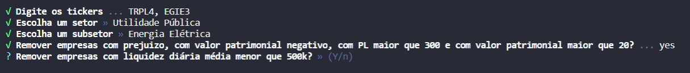
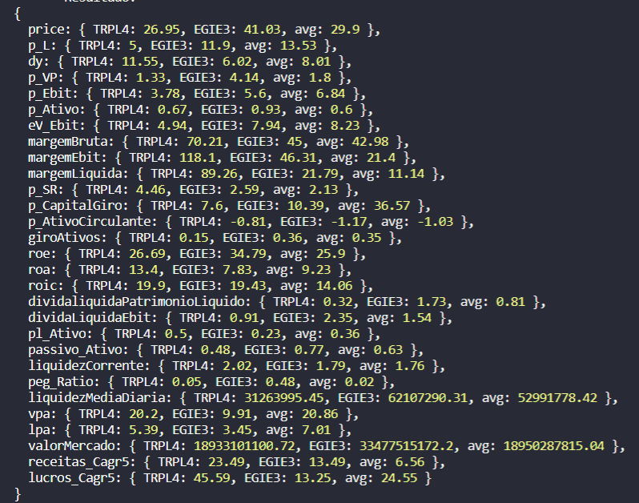
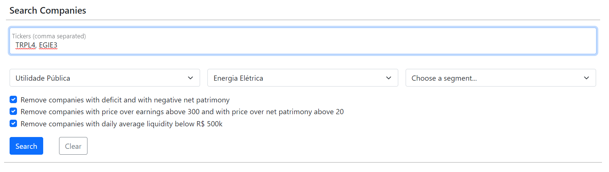
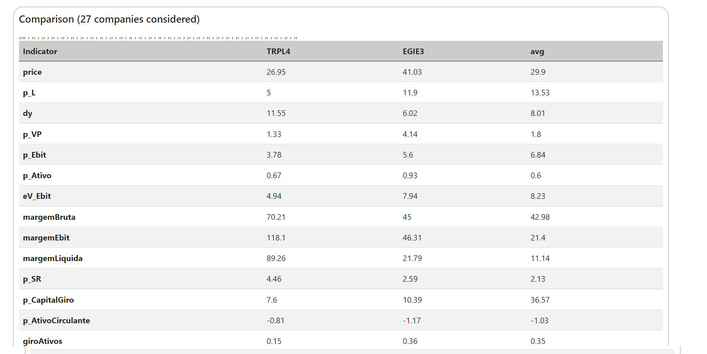

# Stocks Comparer

## Disclaimer

The values provided by this API are not guaranteed to be accurate and by no means represent an indication to buy or sell an asset.

## What

An API that compares fundamentalist indicators between brazilian stocks and display the average indicators of the sector, subsector or segment selected

## Why

Easily view a comparison of fundamentalist indicators between companies and their pairs

## How

The script can be run in two ways: 
 - via cmd
 - via http server

To run **via cmd**:
 - install node.js (version 14.x.x or above);
 - type "npm run cmd" on the command line;
 - fill the inputs asked.

 

 - the result is printed on the terminal

 
 

To run **via web**:
 - install node.js (version 14.x.x or above);
 - type "npm run web";
 - open on the browser the address `localhost:3000/`;
 - fill the inputs asked and press "Search".

 
 

 - the result is displayed in a table

 
 
___
src2: prototype

src: official (WIP)
